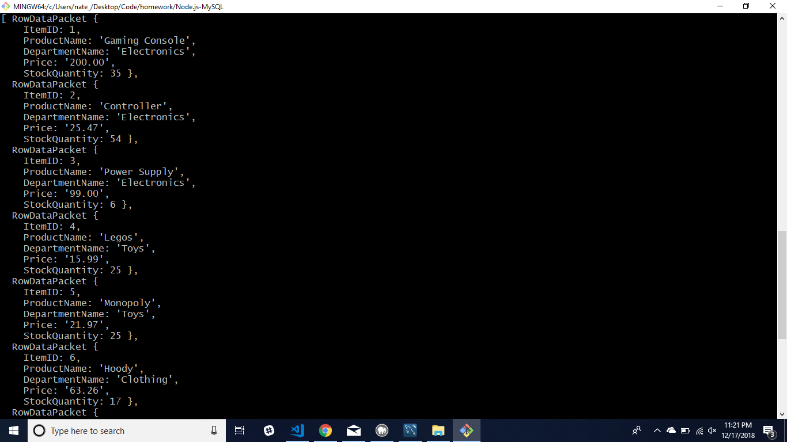
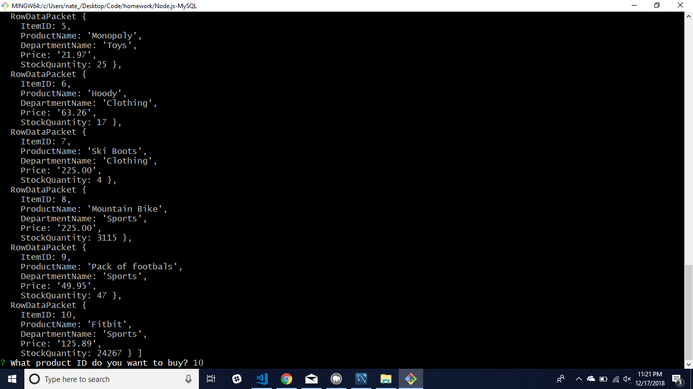
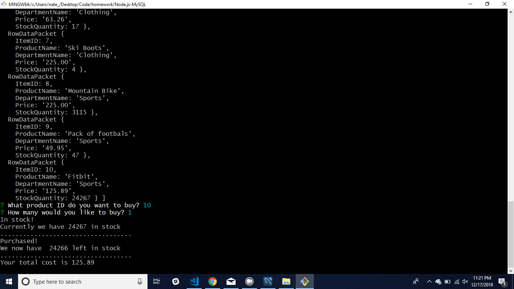

# Node.js-MySQL

When the app is run a customer will pull down the catalog of the store which will list all the items with their product details. 

node bamazonCustomer.js

The customer will be asked which item they would like to purchase. They will pick the ID that corresponds to the product they're interested in.

Once they've chosen an ID the app will ask them how many units they would like to purchase.

Once their input is taken the app will update the bamazon stock for that item and provide the customer their total due for said item.

First 5 Products listed.

Second half of products listed.

Prompt to choose the item.

Prompt to choose the quantity of item.

Updated stock after purchase is complete.

